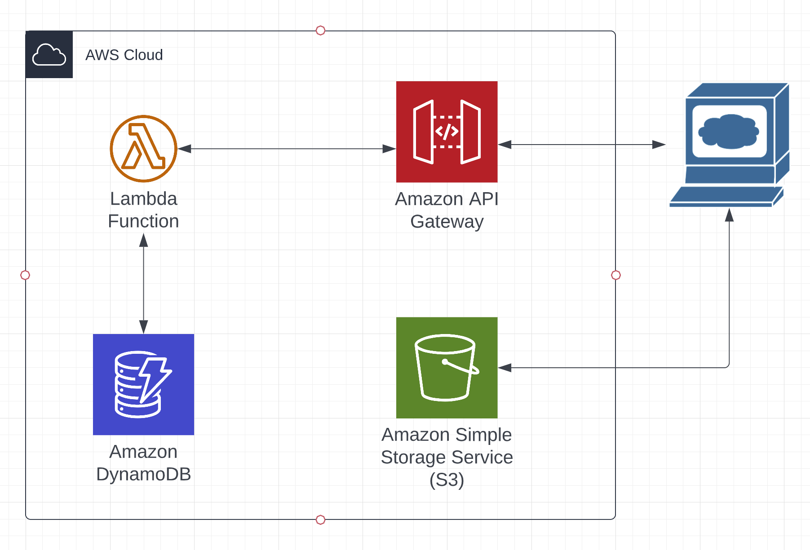

<h1 align="center">Movie Database - AWS cdk demo project</h1>

## About

This is a demo project using an AWS Backend.
The React frontend is a static website hosted on S3, where you can list and search movies from a DynamoDB and add new movies using a POST request.

<p align="center">
  
</p>

Reach the website on this link:

http://movie-api-frontend-lena.s3-website.eu-central-1.amazonaws.com/

## Get Started
Import test data set of movies from root folder: movies-dynamo.json to DynamoDB.

To deploy frontend locally navigate to ```cd ./frontend/movie-frontend```
and then run ```npm start```

## Testing

To run 3 tests run ```npm test```